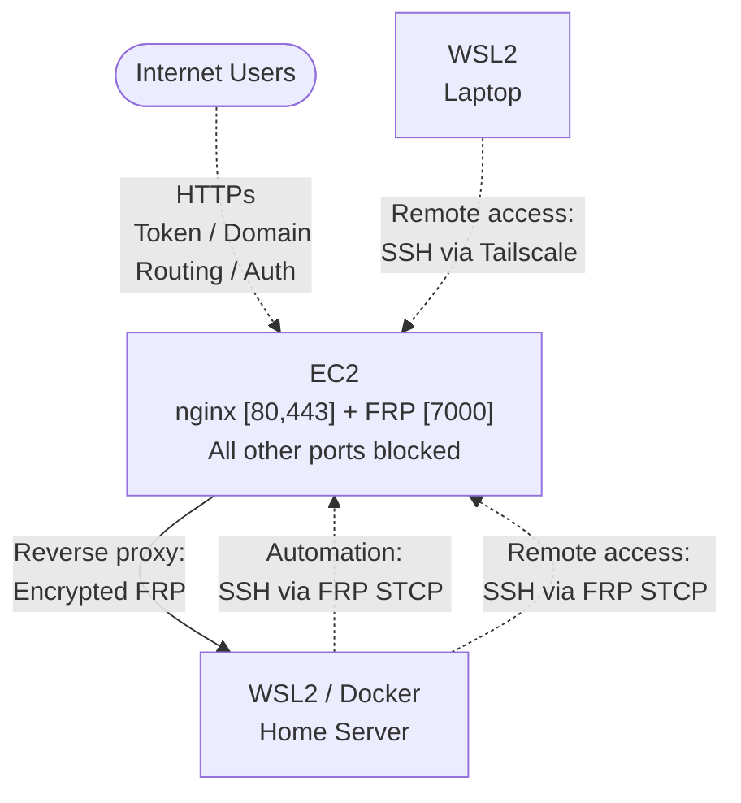

<!-- markdownlint-disable MD022 MD029 MD031 MD032 -->
# AWS Demo Server Setup Guide
## Professional Container Demo Platform with FRP Tunneling

### Architecture Overview



**EC2 Instance Role:** Proxy/tunnel endpoint + secure management  
**Home Server Role:** Runs actual demo containers  
**Access Control:** Tailscale and FRP for remote access, FRP tunnel for automation  
**Cost:** ~$4.44/month | **Setup Time:** ~2 hours | **Maintenance:** Minimal

---

## Phase 1: AWS Infrastructure

### 1.1 Launch EC2 Instance
```bash
# Instance Configuration
AMI: Amazon Linux 2023
Type: t4g.micro Convertible Reserved (1-year)
Storage: 8GB gp3
Key Pair: Create or use existing
```

### 1.2 Security Group Configuration
```text
Port 80 (HTTP)    - Source: 0.0.0.0/0          # Demo access
Port 443 (HTTPS)  - Source: 0.0.0.0/0          # Demo access (SSL)
Port 7000 (FRP)   - Source: 0.0.0.0/0          # Tunnel from home
Port 22 (SSH)     - Source: 100.64.0.0/10      # Tailscale network only
# No direct SSH from internet - only via Tailscale or FRP tunnel
```

### 1.3 Elastic IP & Route 53
```bash
# Allocate Elastic IP and associate with instance
# Create Route 53 records:
demo.anchoredtechnologies.net      A      <elastic-ip>
*.demo.anchoredtechnologies.net    CNAME  demo.anchoredtechnologies.net
```

---

## Phase 2: Server Setup

### 2.1 Initial System Configuration
```bash
# SSH into EC2 instance (initially via key pair)
ssh -i your-key.pem ec2-user@<elastic-ip>

# Update and install packages
sudo yum update -y
sudo yum install -y nginx

# Start services
sudo systemctl start nginx
sudo systemctl enable nginx
```

### 2.2 Install Tailscale
```bash
# Install Tailscale for remote laptop admin access
curl -fsSL https://tailscale.com/install.sh | sh
sudo tailscale up

# Note the Tailscale IP for future personal access
tailscale ip -4
# Example output: 100.64.0.5
```

### 2.3 Install & Configure FRP Server
```bash
# Download FRP
cd /tmp
wget https://github.com/fatedier/frp/releases/download/v0.64.0/frp_0.64.0_linux_amd64.tar.gz
tar -xzf frp_0.64.0_linux_amd64.tar.gz
sudo cp frp_0.64.0_linux_amd64/frps /usr/local/bin/
sudo chmod +x /usr/local/bin/frps

# Create config directory
sudo mkdir -p /etc/frp

# Create FRP server configuration
sudo tee /etc/frp/frps.toml << 'EOF'
# frps.toml
bindPort = 7000
auth.token = "<frp token>"
# Optional dashboard
webServer.port = 7500
webServer.user = "admin"
webServer.password = "<password>"
[transport]
tls.force = true
EOF
```

### 2.4 Create FRP Server Systemd Service
```bash
sudo tee /etc/systemd/system/frps.service << 'EOF'
[Unit]
Description=FRP Server
After=network.target

[Service]
Type=simple
User=nobody
Restart=on-failure
RestartSec=5s
ExecStart=/usr/local/bin/frps -c /etc/frp/frps.toml
LimitNOFILE=1048576

[Install]
WantedBy=multi-user.target
EOF

# Enable and start FRP
sudo systemctl daemon-reload
sudo systemctl start frps
sudo systemctl enable frps
```

### 2.5 Setup Tunnel SSH Access using FRP Client (stcp)
```bash
# Copy frpc from previously download package
sudo cp /tmp/frp_0.64.0_linux_amd64/frpc /usr/local/bin/
sudo chmod +x /usr/local/bin/frpc

# Create frpc to expose stcp ssh service
sudo tee /etc/frp/frpc.ini << 'EOF'
# frpc.toml
serverAddr = "127.0.0.1"
serverPort = 7000
auth.token = "<frp token>"

[[proxies]]
name = "ssh_stcp_server"
type = "stcp"
secretKey = "<stcp service token>"
localIP = "127.0.0.1"
localPort = 22
EOF
```

### 2.6 Create FRP Client Systemd Service
```bash
sudo tee /etc/systemd/system/frpc.service << 'EOF'
[Unit]
Description=FRP Client
After=network.target

[Service]
Type=simple
User=nobody
Restart=on-failure
RestartSec=5s
ExecStart=/usr/local/bin/frpc -c /etc/frp/frpc.toml
LimitNOFILE=1048576

[Install]
WantedBy=multi-user.target
EOF

# Enable and start tunnel SSH daemon
sudo systemctl daemon-reload
sudo systemctl start frpc
sudo systemctl enable frpc
```

---

## Phase 3: Dynamic Subdomain Management

### 3.1 Create File-Based Subdomain System
```bash
# Create nginx config directories
sudo mkdir -p /etc/nginx/demo-configs

# Create intial subdomain-to-port mapping file
sudo tee /etc/nginx/demo-configs/subdomain-ports.conf << 'EOF'
ecommerce.demo.anchoredtechnologies.net 3000;
dashboard.demo.anchoredtechnologies.net 3001;
api.demo.anchoredtechnologies.net 3002;
EOF

# Create initial tokens file
sudo tee /etc/nginx/demo-configs/tokens.conf << 'EOF'
"demo123" "allowed";
"client-abc" "allowed";
"temp-jan-2024" "allowed";
EOF
```

### 3.2 Create Advanced Demo Manager Script
Create [demo-manager.sh](demo-manager.sh) in /usr/local/bin/demo-manager.sh
```bash
sudo chmod +x /usr/local/bin/demo-manager.sh
```

### 3.3 Setup Wildcard SSL with Let's Encrypt + Route 53
#### Install certbot with Route 53 plugin
```bash
sudo yum install -y python3-pip
sudo pip3 install certbot certbot-dns-route53
```

#### Create IAM credentials for certbot (do this in AWS Console or CLI)
1. Create IAM policy: CertbotRoute53Policy
Create this policy in AWS IAM console as `CertbotRoute53Policy`:
```json
{
    "Version": "2012-10-17",
    "Statement": [
        {
            "Effect": "Allow",
            "Action": [
                "route53:ListHostedZones",
                "route53:GetChange"
            ],
            "Resource": "*"
        },
        {
            "Effect": "Allow",
            "Action": [
                "route53:ChangeResourceRecordSets"
            ],
            "Resource": "arn:aws:route53:::hostedzone/*"
        }
    ]
}
```
2. Create IAM user: certbot-route53
3. Attach policy to user
4. Generate access keys

#### Create letsencrypt credentials file
```bash
sudo mkdir -p /etc/letsencrypt
sudo tee /etc/letsencrypt/route53-credentials << 'EOF'
[default]
aws_access_key_id = YOUR_CERTBOT_AWS_ACCESS_KEY
aws_secret_access_key = YOUR_CERTBOT_AWS_SECRET_KEY
EOF

sudo chmod 600 /etc/letsencrypt/route53-credentials
```

#### Request wildcard certificate
```bash
sudo certbot certonly \
  --dns-route53 \
  -d <CHANGE ME domainname> \
  -d <CHANGE ME "*.domainname"> \
  --email <CHANGE ME your-email@example.com> \
  --agree-tos \
  --non-interactive

# Setup auto-renewal
echo "0 12 * * * /usr/bin/certbot renew --quiet" | sudo crontab -
```

### 3.4 Configure Dynamic Nginx Routing
Install [demo-sites-nginx.conf](demo-sites-nginx.conf) into Nginx configuration directory:
```bash
# Copy nginx configuration file
sudo cp demo-sites-nginx.conf /etc/nginx/conf.d/demo-sites.conf

# Test nginx configuration
sudo nginx -t
sudo systemctl reload nginx
```

---

## Phase 4: Home Server Setup (WSL2)

### 4.1 Install FRP Client
```bash
# In WSL2 environment
cd ~
wget https://github.com/fatedier/frp/releases/download/v0.64.0/frp_0.64.0_linux_amd64.tar.gz
tar -xzf frp_0.64.0_linux_amd64.tar.gz
sudo cp frp_0.64.0_linux_amd64/frpc /usr/local/bin/
sudo chmod +x /usr/local/bin/frpc
```

### 4.2 Configure FRP Client
```bash
# Create client config directory
mkdir -p ~/.config/frp

# Create FRP client configuration
tee ~/.config/frp/frpc.toml << 'EOF'
serverAddr = "15.156.163.90"
serverPort = 7000
auth.token = "<frp token>"

[transport]
tls.enable = true

[[visitors]]
name = "ssh_stcp_visitor"
type = "stcp"
serverName = "ssh_stcp_server"
secretKey = "<stcp service token>"
bindAddr = "127.0.0.1"
bindPort = 6000

# The Go template block starts here to generate the proxy configurations
{{- range $_, $v := parseNumberRangePair "3000-3015" "3000-3015" }}
[[proxies]]
name = "demo-ports-{{ $v.First }}"
type = "tcp"
localPort = {{ $v.First }}
remotePort = {{ $v.Second }}
{{- end }}
EOF
```

### 4.3 Create FRP Client Systemd Service
```bash
# Create frpc ystemd service for WSL2
sudo tee /etc/systemd/system/frpc.service << 'EOF'
[Unit]
Description=FRP Client
After=network.target

[Service]
Type=simple
User= CHANGE ME your-username-here
Restart=on-failure
RestartSec=5s
ExecStart=/usr/local/bin/frpc -c /home/ CHANGE ME your-username-here/.config/frp/frpc.toml
LimitNOFILE=1048576

[Install]
WantedBy=multi-user.target
EOF

# Start and enable service
sudo systemctl daemon-reload
sudo systemctl start frpc
sudo systemctl enable frpc
```

### 4.4 Install Docker
#### Add Docker's official GPG key
```bash
sudo apt-get update
sudo apt-get install ca-certificates curl gnupg
sudo install -m 0755 -d /etc/apt/keyrings
curl -fsSL https://download.docker.com/linux/ubuntu/gpg | sudo gpg --dearmor -o /etc/apt/keyrings/docker.gpg
```
#### Set up the Docker repository
```bash
echo "deb [arch=$(dpkg --print-architec-ture) signed-by=/etc/apt/keyrings/docker.gpg] https://download.docker.com/linux/ubuntu $(. /etc/os-release && echo "$VERSION_CODENAME") stable" | sudo tee /etc/apt/sources.list.d/docker.list > /dev/null
```
#### Install the Docker Engine
```bash
sudo apt-get update
sudo apt-get install docker-ce docker-ce-cli containerd.io docker-buildx-plugin docker-compose-plugin
```
#### Manage Docker as a Non-Root User
To avoid having to use sudo for every Docker command, add your user to the docker group.
```bash
sudo usermod -aG docker $USER
```
After this, you need to either log out and log back in, or restart your WSL 2 terminal.

#### Verification
Now you can run Docker commands without sudo, and they will work exactly as they would on a native Linux machine.
```bash
docker run hello-world
```

---

## Phase 5: Install Tailscale on laptop (WSL2)
```bash
# Install Tailscale in WSL2 for personal access
curl -fsSL https://tailscale.com/install.sh | sh
sudo tailscale up
```

---

## Phase 6: Container Demo Setup

### 6.1 Docker Compose Example
```yaml
# ~/demos/docker-compose.yml
version: '3.8'

services:
  # Demo App 1 - Static Site
  ecommerce:
    image: nginx:alpine
    ports:
      - "3000:80"
    volumes:
      - ./ecommerce-content:/usr/share/nginx/html
    restart: unless-stopped

  # Demo App 2 - Node.js App
  dashboard:
    build: ./dashboard
    ports:
      - "3001:3000"
    environment:
      - NODE_ENV=production
    restart: unless-stopped

  # API Backend
  api:
    image: your-api-image:latest
    ports:
      - "3002:8000"
    environment:
      - DATABASE_URL=sqlite:///data/demo.db
    volumes:
      - ./api-data:/data
    restart: unless-stopped
```

### 6.2 Sample Demo Content
```bash
# Create demo content
mkdir -p ~/demos/ecommerce-content
cat > ~/demos/ecommerce-content/index.html << 'EOF'
<!DOCTYPE html>
<html>
<head>
    <title>E-commerce Demo - Anchored Technologies</title>
    <style>
        body { font-family: Arial; margin: 40px; background: #f5f5f5; }
        .header { background: #2196F3; color: white; padding: 20px; border-radius: 8px; }
        .feature { background: white; margin: 20px 0; padding: 20px; border-radius: 8px; box-shadow: 0 2px 4px rgba(0,0,0,0.1); }
    </style>
</head>
<body>
    <div class="header">
        <h1>🛒 E-commerce Platform Demo</h1>
        <p>Anchored Technologies - Professional Demo Environment</p>
    </div>
    <div class="feature">
        <h3>✅ Secure Token-Based Access</h3>
        <p>Controlled demo access with revokable tokens</p>
    </div>
    <div class="feature">
        <h3>✅ Custom Domain Routing</h3>
        <p>Professional URLs with SSL encryption</p>
    </div>
    <div class="feature">
        <h3>✅ Container Orchestration</h3>
        <p>Scalable, isolated demo environments</p>
    </div>
</body>
</html>
EOF
```

---

## Usage & Management

### Basic Demo Workflow

#### **1. Create New Demo**
```bash
# On HOME SERVER: Start new container
docker run -d -p 3004:80 your-new-demo:latest

# Register demo via SSH tunnel
ssh ec2-demo "sudo demo-manager add-demo inventory 3004"

# Add token for client access
ssh ec2-demo "sudo demo-manager add-token client-feb-2024"

# Share URL: https://inventory.demo.anchoredtechnologies.net/?token=client-feb-2024
```

#### **2. Client-Specific Demos**
```bash
# Create client-specific token
ssh ec2-demo "sudo demo-manager add-token client-acme-jan2024"

# Share URL with client
# https://ecommerce.demo.anchoredtechnologies.net/?token=client-acme-jan2024

# Remove after demo period
ssh ec2-demo "sudo demo-manager remove-token client-acme-jan2024"
```

#### **3. Temporary Staging Environment**
```bash
# On HOME SERVER: Deploy staging build
docker-compose -f docker-compose.staging.yml up -d

# Register and create token
ssh ec2-demo "sudo demo-manager add-demo staging 3010"
ssh ec2-demo "sudo demo-manager add-token staging-review-feb"

# Share for review: https://staging.demo.anchoredtechnologies.net/?token=staging-review-feb
```

### Management Commands

#### **Server Management (Multiple Access Methods)**

**Personal Management (via Tailscale):**
```bash
# Secure personal access via Tailscale
ssh ec2-personal

# Full administrative access
sudo systemctl status frps nginx sshd-tunnel
sudo journalctl -u frps -f
sudo demo-manager list-demos
sudo certbot certificates
```

**Container Automation (via FRP Tunnel):**
```bash
# Automated demo management from containers or scripts
ssh ec2-demo "sudo demo-manager add-demo inventory 3004"
ssh ec2-demo "sudo demo-manager add-token client-feb-2024"
ssh ec2-demo "sudo demo-manager list-demos"
```

#### **Home Server Management (WSL2/Linux)**
```bash
# Check FRP client status
sudo systemctl status frpc
sudo journalctl -u frpc -f

# Start/stop demo containers
cd ~/demos
docker-compose up -d
docker-compose down

# View container logs
docker-compose logs -f ecommerce

# Update demo containers
docker-compose pull
docker-compose up -d --force-recreate

# Quick demo registration
ssh ec2-demo "sudo demo-manager add-demo $(basename $PWD) 3005"
```

#### **Monitoring & Troubleshooting**
```bash
# Test tunnel connectivity from home
curl -H "Host: ecommerce.demo.anchoredtechnologies.net" http://localhost:3000

# Test token authentication
curl "https://ecommerce.demo.anchoredtechnologies.net/?token=demo123"

# Monitor nginx access logs on EC2
sudo tail -f /var/log/nginx/access.log

# Check FRP tunnel status
ssh ec2-demo "sudo netstat -tlnp | grep :3000"

# Test SSH tunnel
ssh ec2-demo "echo 'SSH tunnel working!'"
```

---

## Cost Breakdown

| Component | Monthly Cost | Notes |
|-----------|--------------|--------|
| EC2 t4g.micro Reserved | $3.00 | Convertible 1-year term |
| EBS Storage (8GB) | $0.64 | gp3 volume |
| Elastic IP | $0.00 | No charge when attached |
| Route 53 Hosted Zone | $0.50 | DNS management |
| Data Transfer | ~$0.30 | Light demo traffic |
| Tailscale | $0.00 | Free tier (personal use) |
| **Total** | **~$4.44/month** | Professional demo platform |

---

## Security Features

- ✅ **Token-based authentication** - Easy to manage, revoke
- ✅ **Wildcard SSL encryption** - All subdomains automatically secured
- ✅ **Encrypted FRP tunnels** - TLS encryption for all traffic
- ✅ **Dual access control** - Tailscale for personal, FRP tunnel for automation
- ✅ **No direct SSH exposure** - Internet cannot reach SSH directly
- ✅ **Separate SSH daemon** - Isolated tunnel access
- ✅ **Outbound-only tunnels** - No inbound firewall rules needed
- ✅ **Container isolation** - Apps run in isolated environments
- ✅ **AWS security groups** - Network-level access control

**Security Architecture:**
```text
Internet Users → HTTPS/TLS (wildcard) → EC2 → Encrypted FRP Tunnel → Home Server
Personal Management → Tailscale (WireGuard) → EC2 SSH:22
Container Automation → SSH through FRP tunnel:2223 → EC2 demo-manager  
Remote Troubleshooting → SSH through FRP tunnel (bidirectional) → Home Server
```

All traffic paths are encrypted end-to-end. Personal access via secure Tailscale mesh, automation via FRP tunnel. No direct SSH exposure to internet.

---

## Benefits Summary

**For Developers:**
- Professional demo URLs with custom domains
- Wildcard SSL - add new subdomains without certificate management
- Easy container deployment and management
- Secure remote access for troubleshooting
- File-based configuration - easy to backup and version control

**For Business:**
- Low monthly cost (~$4.44)
- Reliable uptime and performance
- Professional appearance to clients
- Easy token management for access control
- Scalable architecture for growth

**For Operations:**
- Minimal maintenance overhead
- Dual secure access methods (Tailscale + FRP tunnel)
- Automated SSL certificate renewal
- Monitoring and logging built-in
- Remote management capabilities
- Container orchestration ready
- Secure mesh networking for personal access

---
## Future Automation Possibilities

### Container Self-Registration

**Automatic demo registration on container startup:**

#### Enhanced Container Entrypoint Script
```bash
#!/bin/bash
# /usr/local/bin/auto-register-demo.sh

SUBDOMAIN="${DEMO_SUBDOMAIN:-app}"
PORT="${DEMO_PORT:-3000}"
EC2_HOST="your-ec2-elastic-ip"

register_demo() {
    echo "🚀 Registering demo: $SUBDOMAIN on port $PORT"
    ssh -p 2223 -i /container/ssh/automation-key \
        ec2-user@$EC2_HOST \
        "sudo demo-manager add-demo $SUBDOMAIN $PORT"
}

deregister_demo() {
    echo "🛑 Deregistering demo: $SUBDOMAIN"
    ssh -p 2223 -i /container/ssh/automation-key \
        ec2-user@$EC2_HOST \
        "sudo demo-manager remove-demo $SUBDOMAIN"
}

# Register on startup
register_demo

# Deregister on clean shutdown
trap deregister_demo EXIT SIGTERM SIGINT

# Start actual application
exec "$@"
```

#### Self-Registering Container Example
```dockerfile
FROM nginx:alpine

# Add SSH client and automation key
RUN apk add --no-cache openssh-client
COPY ssh/automation-key /container/ssh/automation-key
RUN chmod 600 /container/ssh/automation-key

# Add auto-registration script
COPY auto-register-demo.sh /usr/local/bin/
RUN chmod +x /usr/local/bin/auto-register-demo.sh

# Use auto-registration as entrypoint
ENTRYPOINT ["/usr/local/bin/auto-register-demo.sh"]
CMD ["nginx", "-g", "daemon off;"]
```

#### Usage with Environment Variables
```bash
# Automatic demo registration
docker run -d \
  -p 3005:80 \
  -e DEMO_SUBDOMAIN=special-client \
  -e DEMO_PORT=3005 \
  self-registering-demo:latest

# Demo automatically available at:
# https://special-client.demo.anchoredtechnologies.net/?token=<your-token>
```

### Bidirectional SSH for Remote Troubleshooting

**Enable remote access to home server for emergency fixes:**

#### Enhanced FRP Client Configuration
```ini
[common]
server_addr = your-ec2-elastic-ip
server_port = 7000
token = your-token
tls_enable = true

# Demo ports (forward tunnel)
[demo-ports]
type = tcp
local_port = 3000-3999
remote_port = 3000-3999

# Container SSH to EC2 (forward tunnel)
[ssh-to-ec2]
type = tcp
local_port = 22
remote_port = 2223

# EC2 SSH to home (reverse tunnel)
[ssh-from-ec2]
type = tcp
remote_port = 2224
local_port = 22
```

#### WSL2 SSH Server Setup
```bash
# Install SSH server in WSL2
sudo apt update && sudo apt install openssh-server -y

# Configure for reverse access
sudo tee /etc/ssh/sshd_config << 'EOF'
Port 22
PermitRootLogin no
PasswordAuthentication no
PubkeyAuthentication yes
AuthorizedKeysFile .ssh/authorized_keys
EOF

# Add EC2 public key for reverse access
mkdir -p ~/.ssh
echo "ssh-rsa AAAA...ec2-reverse-key ec2-access" >> ~/.ssh/authorized_keys
chmod 600 ~/.ssh/authorized_keys

# Start SSH daemon
sudo service ssh start
sudo systemctl enable ssh
```

#### Remote Emergency Management
```bash
# From EC2, SSH to home server through tunnel
ssh -p 2224 your-wsl-username@127.0.0.1

# Remote demo troubleshooting scenarios:
# 1. Fix broken demo during client call
docker ps
docker logs failing-container
docker restart failing-container

# 2. Deploy emergency fix
cd ~/demos/critical-app
git pull origin hotfix
docker build -t critical-app:hotfix .
docker stop critical-app
docker run -d -p 3010:80 critical-app:hotfix

# 3. Start new demo remotely
docker run -d -p 3015:80 special-request-demo:latest
exit  # Back to EC2
sudo demo-manager add-demo emergency 3015
```

### GitOps Integration

**Automatic demo deployment from git repositories:**

#### CI/CD Pipeline Integration
```yaml
# .github/workflows/deploy-demo.yml
name: Deploy Demo
on:
  push:
    branches: [demo]

jobs:
  deploy:
    runs-on: ubuntu-latest
    steps:
      - uses: actions/checkout@v2
      - name: Deploy to Demo Platform
        run: |
          # Build and push to registry
          docker build -t demo-app:${{ github.sha }} .
          docker push your-registry/demo-app:${{ github.sha }}
          
          # Deploy via SSH
          ssh -p 2223 ec2-user@your-ec2-ip \
            "curl -X POST localhost:8080/deploy \
             -d 'image=demo-app:${{ github.sha }}&subdomain=pr-${{ github.event.number }}'"
```

### Webhook-Based Demo Deployment
```bash
# Simple webhook receiver on EC2
cat > /usr/local/bin/demo-webhook << 'EOF'
#!/bin/bash
# Receives webhook, pulls image, starts demo, registers subdomain
# POST /deploy?image=demo-app:v1.0&subdomain=feature-x
EOF
```

These future enhancements would transform the platform into a fully automated, self-managing demo environment where containers register themselves, demos can be remotely managed, and deployments happen automatically from your development workflow.
